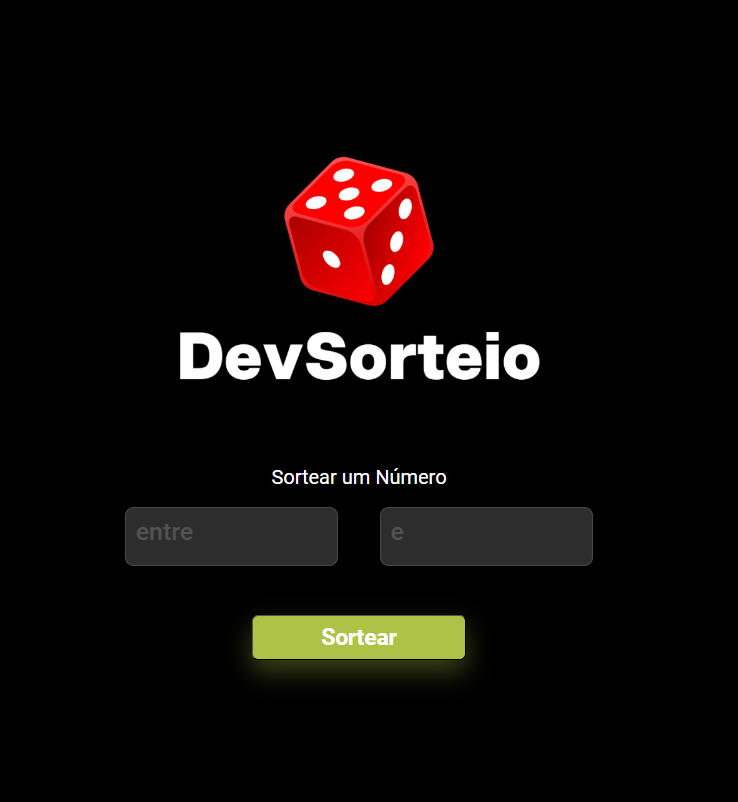

<h1 align="center" style="    max-width: 250px;
    margin: 30px 0;">
    <br>
    Prize Draw &nbsp; :game_die:
</h1>

[We are ONLINE, try Now](https://joaovictordiass.github.io/-Prize-Draw/) :tada:<br>

<h4 align="center">
  A website where you can carry out draws between numbers.
</h4>

## :rocket: Technologies

This project was developed with the following technologies:

- 
- 
- 

## :information_source: How To Use

To clone this application.

```bash
# Clone this repository
$ git clone https://github.com/joaovictordiass/-Prize-Draw.git
```

## :sunny: Result

  <div style="display: flex;   flex-direction: column;
  align-items: center;">
  <h1 align="center" style="display: flex; flex-direction:row;">
      

Made with ♥ by João Victor :wave: [Get in touch!](https://www.linkedin.com/in/jo%C3%A3o-victor-dias-4235a52aa/)
